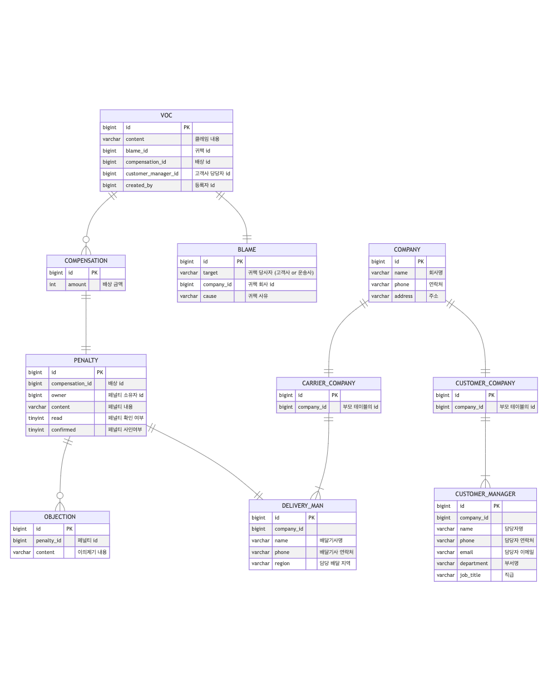

# 팀프레시 사전과제

## 서버 실행 방법
### 1. 데이터베이스 설정 및 실행
컨테이너명과 볼륨 마운트 경로는 수정해도 무방하나, `MYSQL_ROOT_PASSWORD`와 `MYSQL_DATABASE`는 변경할 경우 서버 구동이 정상적으로 되지 않습니다.

변경하고 싶다면 `applicaion.yml`파일도 함께 수정해야 합니다.
```bash
docker run -d -p 3306:3306 \
  --name [컨테이너명] \
  --v {볼륨 마운트 경로}:/var/lib/mysql \
  -e MYSQL_ROOT_PASSWORD=root1234 \
  -e MYSQL_DATABASE=team_fresh \
  mariadb:10.8.3 --character-set-server=utf8mb4 --collation-server=utf8mb4_unicode_ci
```

### 2. 서버 실행
해당 리포지토리를 다운로드 혹은 clone 한 뒤, `docker-compose`를 이용해 실행합니다.

반드시 경로를 프로젝트 디렉터리로 변경하세요.
```bash
# 프로젝트 경로로 이동
cd tean-fresh-assignment

# 서버 실행
docker-compose up -d

# 서버 종료
docker-compose down
```

실행 권한이 없을 경우 아래 명령어 실행 후 다시 시도하세요.
```bash
chmod +x gradlew
```

## 테이블 스키마


## 클래스 다이어그램
